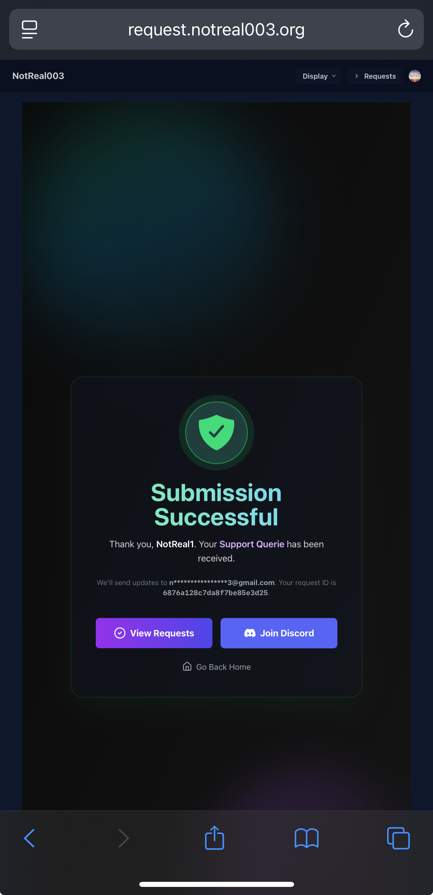
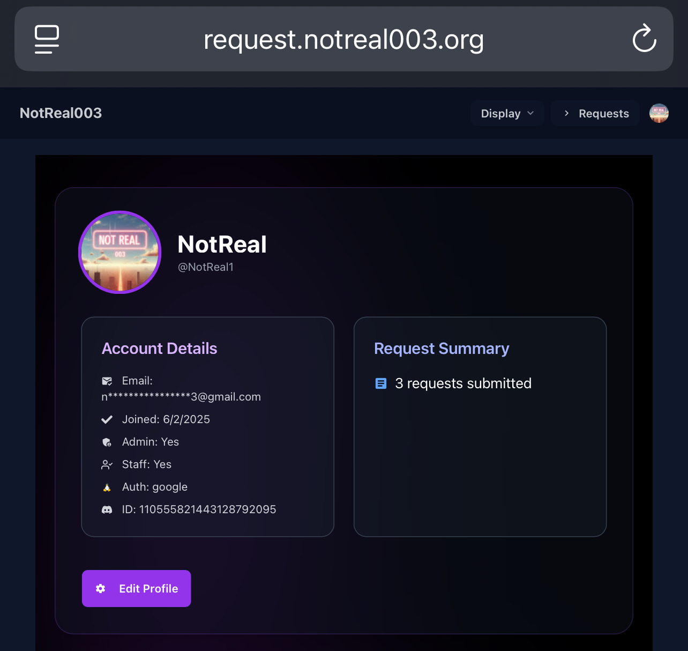
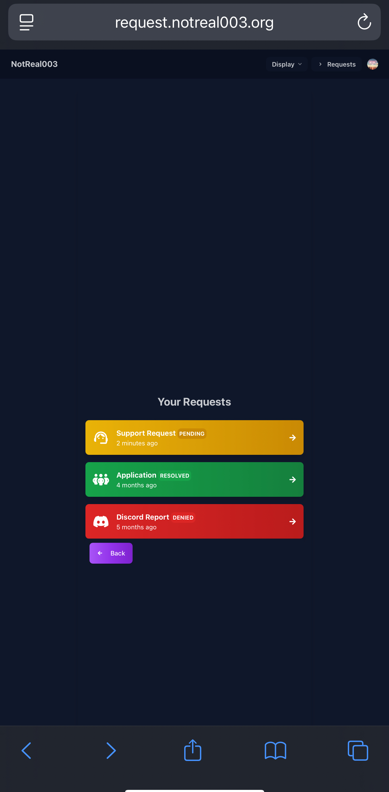
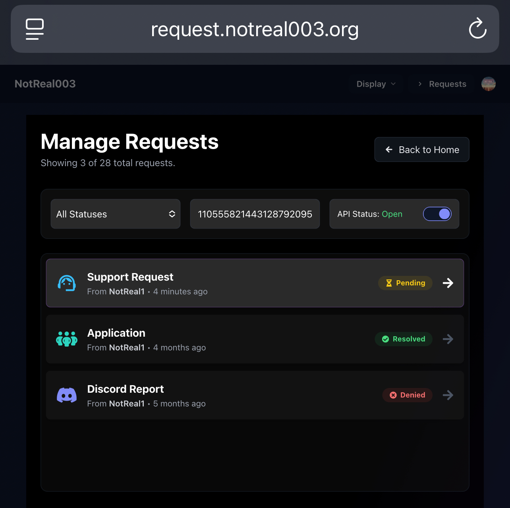
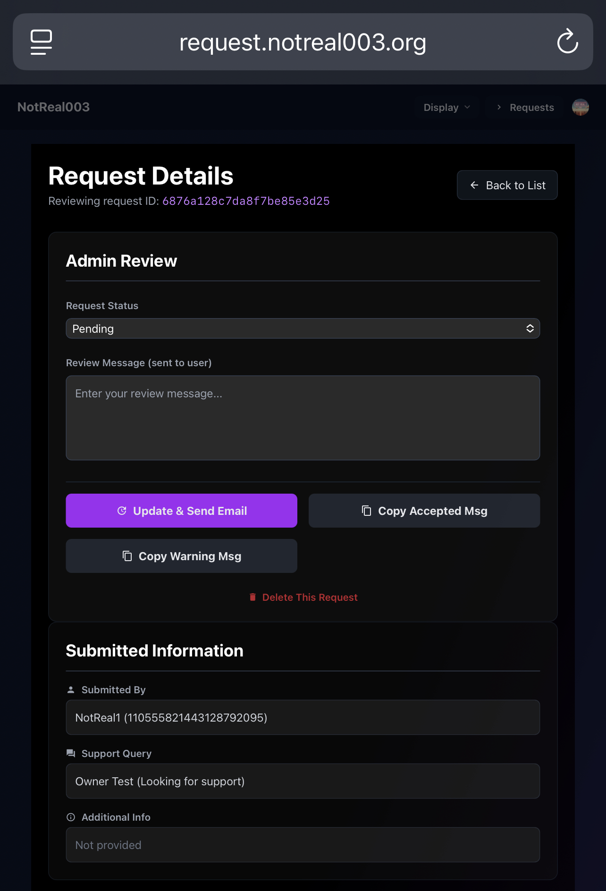
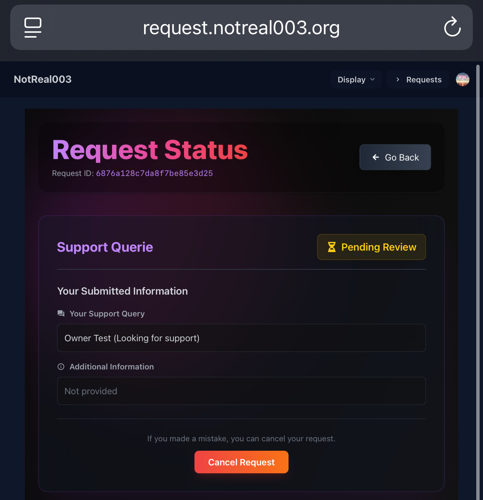
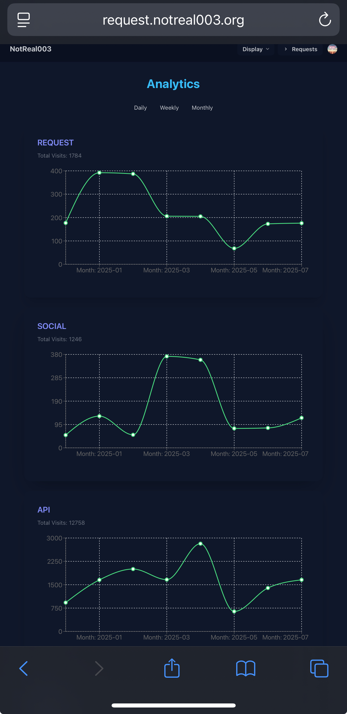
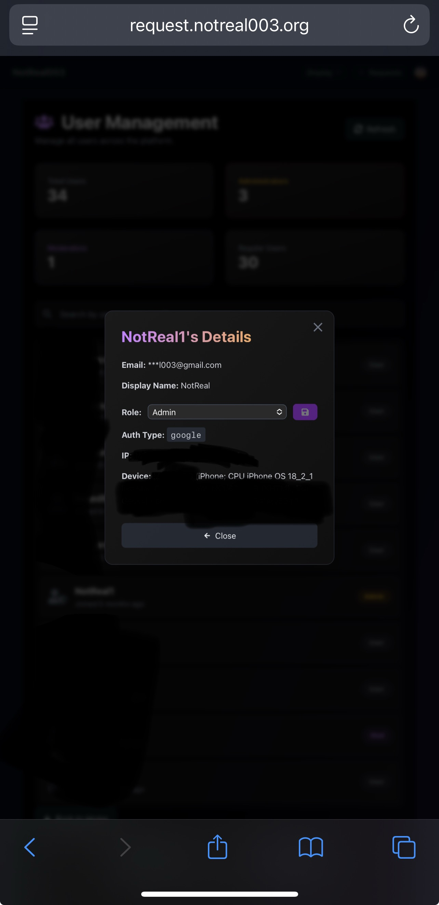
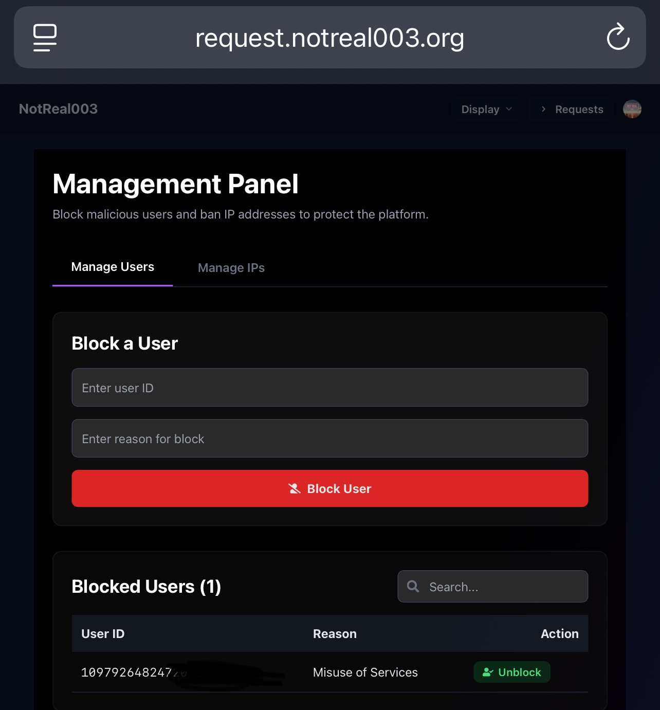

# 🛠️ Request Management Portal (RMP) — Fullstack Web App & API

::: tip STATUS  
**Production-Ready** | **License-Based Distribution Model** available at __[store.notreal003.org](https://store.notreal003.org)__
:::

The **Request Management Portal** is a complete fullstack solution for managing user requests, approvals, and role-based administration. It’s designed for internal teams, SaaS workflows, or support portals — powered by a responsive React frontend and a scalable Node.js/Express API.

---

## 🔍 Overview

Built with clean architecture and secure practices, this system includes:

- A fully responsive **React frontend**
- A robust **Node.js + Express backend**
- **OAuth login** (Google & Discord)
- **JWT-secured sessions** and role-based access control
- **Discord webhook logging**, optional **email verification**
- **Admin-only dashboards** for request and user management

---

## ✅ What You Get

> ⚡ **Save 150–200+ development hours** — and avoid $15,000+ of engineering effort by acquiring a ready-to-use production system with clean code.

**Deliverables:**
- ✅ Full source code: Frontend (React) + Backend (Node.js/Express)
- ✅ GitHub repository (or zipped archive)
- ✅ Setup guide with `.env.example`
- ✅ Deployment help (optional)
- ✅ **Commercial-use license (Personal, Developer, or Extended)**

---

## 💵 Licensing & Pricing

Choose the license that best fits your needs:

| License Tier     | Price | Features                                                                 |
|------------------|-------|--------------------------------------------------------------------------|
| Personal         | $49   | Use for personal or non-commercial project                               |
| Developer        | $99   | Use in 1 commercial product (no resale)                                  |
| Extended         | $199  | White-label, resell, modify, and deploy commercially with attribution    |

- 📁 Code is licensed, not open-source
- 🔑 Each license allows deployment with limits described
- 🚫 Redistribution or public sale is not permitted without Extended License
- 💼 No IP or repository ownership is transferred

### 👉 GET NOW ON: __https://store.notreal003.org__

---

## 🧠 Key Use Cases

- 📌 Support ticket system for internal or external users
- 🧩 Base template for building MERN SaaS applications
- 🛠️ Admin portals with request flow logic
- 🧑‍💼 Team-based approval workflows

---

## 📸 UI Previews
::: tip SCREENSHOTS
All the screenshots shown below are taken from the currently operational [request.notreal003.org](https://request.notreal003.org) web app, this app is well tested and currently our page has 34 users.
:::


| Functionality | Screenshot |
|--------------|------------|
| Request Submission |  |
| Profile Viewer |  |
| Request History |  |
| Admin: View Requests |  |
| Admin: Request Review |  |
| Request Viewer |  |
| API & Site Analytics |  |
| Admin: User Manager |  |
| Admin: User Role View |  |
| Blocking Users/IPs |  |

---

## 🧰 Tech Stack

| Layer       | Tech                                         |
|-------------|----------------------------------------------|
| Frontend    | React + Tailwind (SPA)                       |
| Backend     | Node.js + Express                            |
| Database    | MongoDB + Mongoose                           |
| Auth        | Google & Discord OAuth + JWT                 |
| Logging     | Discord Webhooks (errors + login events)     |

---

## 🔐 Security & Architecture

- 🔒 JWT-based session auth
- 🛡️ IP/device logging on login
- 🧠 Admin-only route control
- 📤 Email code verification (optional)
- 💾 `.env`-driven config system
- 📜 Discord webhooks for error & auth event logs

---

## 📜 Licensing & Legal

::: warning LEGAL NOTICE  
As of **July 13, 2025**, this project is **NO LONGER open source** and is now distributed under a **paid license**.
:::

- 📄 Buyers receive a **commercial license** based on the selected tier:
  - **Personal License ($49)**: Use for personal or internal projects. No redistribution or resale.
  - **Developer License ($99)**: Use in unlimited client/commercial projects. No resale or white-labeling.
  - **Extended License ($199)**: Includes white-label rights and permission to integrate into commercial SaaS or resell as part of a larger product.
- 🧑‍💼 You may **use, modify, and integrate** the code based on your license tier
- ❌ Redistribution, public listing, or resale is **not allowed** under Personal/Developer tiers
- ✅ Extended license allows **white-label use** and resale/integration into other commercial platforms
- 🧾 A formal **license document** is included with every purchase

---

## 📞 Contact & Demo

- 🌐 Live Demo: [request.notreal003.org](https://request.notreal003.org)
- 📧 Email: `noreply.notreal003@gmail.com`
- 💬 Discord: Join our [server](https://notreal003.org/discord) and DM `notnt77`

---

# 📦 Request Management Portal-API — Setup & Usage Guide

::: tip  
This section covers full technical deployment, authentication, admin workflows, and security setup for developers.
:::

## 🧾 Prerequisites

- Node.js v14+
- MongoDB Atlas or local instance
- Google + Discord OAuth credentials
- (Optional) Gmail App Password for email verification
- Webhook URLs for Discord logging

---

## 🧪 Environment Variables

Create a `.env` file with the following:

```bash
SESSION_SECRET=your_secret
PORT=3001
MONGODB_URI=your_mongo_uri
GOOGLE_CLIENT_ID=xxx
GOOGLE_CLIENT_SECRET=xxx
DISCORD_CLIENT_ID=xxx
DISCORD_CLIENT_SECRET=xxx
DISCORD_REDIRECT_URI=https://your-domain.com/callback
EMAIL=your@gmail.com
EPASS=your_gmail_app_password
JWT_SECRET=strong_random_value
ADMIN_ID=admin_mongo_id
ERROR_WEBHOOK=https://discord.com/api/webhooks/…
USER_AUTH_WEBTOKEN=https://discord.com/api/webhooks/…
```
---

## 🚀 Backend Setup Instructions

```bash
git clone https://github.com/NotReal003/API.git
cd API
npm install
cp .env.example .env
# Fill in the .env fields
npm start

For development:

npx nodemon index.js
```

⸻

### 🔑 Authentication Flows

| **Provider** | **Endpoint**                     | **Notes**                                                   |
|--------------|----------------------------------|-------------------------------------------------------------|
| Google       | `/auth/internal/google`          | Live, session-based auth                                    |
| Discord      | `/auth/internal/discord`         | Fully supported                                              |
| GitHub       | `/auth/internal/github`          | **Disabled** in production (can be enabled from codebase)   |
| Email        | `/auth/internal/e-signin`        | Optional 6-digit OTP (disabled by default)                  |
| JWT Use      | _Used in routes like_ `/auth/internal/ip` | For IP logging, session tracking, and secure auth     |

---

### 📡 API Overview

| **Method** | **Route**                                           | **Description**                 |
|------------|-----------------------------------------------------|---------------------------------|
| POST       | `/requests`                                         | Submit a new request            |
| GET        | `/requests`                                         | Get user’s request history      |
| PUT        | `/requests/:id/status`                              | Admin: update request status    |
| PATCH      | `/admins/internal/staff/manage/:userId/role`        | Admin: change user role         |
| PUT        | `/admins/internal/staff/demote/:userId`             | Demote user                     |

---

### 👑 Admin Management

- **Admin Panel UI**:  
  Visit `/admins` in the browser — serves protected React-based admin interface.

- **Promote User to Admin:**
  ```http
  PATCH /admins/internal/staff/manage/{userId}/role
  Content-Type: application/json

  {
    "role": "admin"
  }
  ```

- Only admins or owner: true can assign roles

⸻

🛡️ Security, Logs & Error Handling
- Discord webhook logs:
- ERROR_WEBHOOK: uncaught server errors
- USER_AUTH_WEBTOKEN: IP/device login events
- Sensitive routes require JWTs or session cookies
- .env-based config keeps secrets out of version control
- HTTPS recommended for deployment

⸻

💡 Best Practices
- Use strong values for JWT_SECRET, SESSION_SECRET
- Always configure OAuth redirect URIs correctly
- Do not commit .env files
- Secure cookies in production
- Disable unused auth flows unless needed

⸻

🎨 Frontend Features & Setup

🔧 Frontend Features
- Request Form Pages: Users can submit various types of requests, including reports, support requests, and applications.
- Authentication: JWT-based login/logout with dynamic status display in the navbar.
- Admin Panel: Administrators can view, approve, reject, or cancel requests and leave review messages.
- User Dashboard: Users can view their request history and status updates.
- Responsive Design: Optimized for various devices using modern design practices.
- More Features: Some features are not listed here.

🚀 Frontend Setup
1. Clone the repository

```bash
git clone https://github.com/NotReal003/Requests.git
```
2. Install dependencies:

```bash
npm install
```
3. Create a .env file and add your API URL:
 
```bash
REACT_APP_API=your_api_url
CI=false
```

4. Start the React app:
 
 ```bash
npm start (for development)
npm run build (for production (output will be in /build))
```

⸻

🙏 Final Note

You’re viewing the complete documentation and business offer for the Request Management Portal — a powerful, customizable MERN-stack system ready for production.

Reach out if you’re interested in buying, deploying, or customizing.

---
